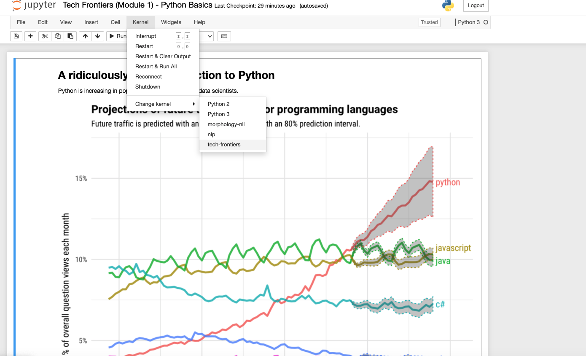
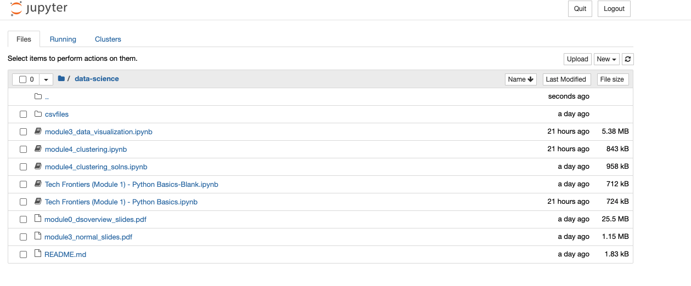

# Tech Frontiers

This is the course website for the CU Boulder [Tech Frontiers](https://www.colorado.edu/engineering/academics/tech-frontiers-executive-education) professional development program. See the [Data Science](/data-science) page for information and schedule specific to the Data science course. See the [Machine Learning](/machine-learning) page for information and schedule regarding the Machine Learning course.

## Getting Started

Before arriving for class, you should get your environment setup on your computer and ensure that you can run python, and the required packages. If you are an experienced Python user, you may wish to skim or skip these materials. You will still want to check the [required packages](#required-packages)

We assume setup is done via the terminal, or windows command line. If you are on windows, and are unsure how to access this, [here](https://www.computerhope.com/issues/chusedos.htm) is a resource with some basic command-line help. For mac users, [here](https://www.businessinsider.com/how-to-open-terminal-on-mac) is an article with some terminal basics. If you are a linux user, we assume you are already familiar with the terminal basics.

To start, you can `clone` this repository by, from your terminal, running

```bash
git clone https://gitfront.io/r/adamits/0f5439b554e8919a518458370b4e89f937340ea7/tech-frontiers.git
```
If you do not have git installed, you can install it by following the instructions [in the section below](#install-git)

This will create a new folder called `tech-frontiers` with all of the content in this github. As we release more content, you can update your directory by calling `git pull origin master` from your terminal, from within the `tech-frontiers` directory. Note that if you prefer not to clone the repository, you can download individual content here as you go.

If you encounter any issues while following these steps, you can contact adam.wiemerslage@colorado.edu for help.

### Install Git
Installation instructions for git are [here](https://git-scm.com/book/en/v2/Getting-Started-Installing-Git). If the `git clone` command does not work, you may need to install git. Alternatively, you do not need to clone the repository, and can simply download individual pages from the website as you go.

### Install anaconda
Anaconda is the package manager we will be using to download our python packages. Note that installing anaconda should also install python. When you activate the anaconda environment, you should have access to the python version installed with it. In order to install anaconda follow the links below.

The links include optional instructions for pycharm users. If you do not use the pycharm IDE - you can ignore this part!

 - For **Windows** users you can follow the guide [here](https://docs.anaconda.com/anaconda/install/windows/).
 - For **macOS** users you can follow the guide [here](https://docs.anaconda.com/anaconda/install/mac-os/). If you do not have permission to install in the default directory, your user's home directory should work fine.
 - For **Linux** users, follow instructions [here](https://docs.anaconda.com/anaconda/install/linux/)


 **IMPORTANT For windows users**, you may need to use the `Anaconda Prompt` instead of the command line. This is a program that should be installed after following the above instructions. More information on this [here](https://docs.anaconda.com/anaconda/user-guide/getting-started/#open-prompt-win), but you can find it in your list of applications, and use that for the remainder of the instructions.

### Install python packages
Our instructions assume that you are using anaconda from the terminal (or windows command line).

We have provided an environment.yml file that contains all of the packages you will need for both courses. In order to create an anaconda environment for managing packages, and install packages, you can run:

```bash
conda env create --file environment.yml
```

### Activate your anaconda environment
You can activate your anaconda environment, which will use the anaconda python distribution, and point to all of the packages installed therein, with the following command:

```bash
conda activate myenv
```

If you installed from the environment.yml, the environment will be called `tech-frontiers` - so it can be activated with `conda activate tech-frontiers`. Alternatively, you can create create an anaconda environment with

```bash
conda create --name env-name python=3.9
```

This will create an environment called `env-name`, and install python version 3.9 in the environment. Then, after activating this new environment, you can simply install packages with

```bash
conda install package-name
```

Or if conda does not find the package:

```bash
conda install -c conda-forge package-name
```

##### Required Packages
```
pytorch
numpy
scikit-learn
pandas
matplotlib
scipy
seaborn
jupyter
plotly
nbformat
hmmlearn
```

Note that by installing jupyter inside your conda environment, your jupyter notebooks kernel should be able to access all of your python packages. Alternatively, you can install your conda environment as a specific kernel for jupyter to use, as below.

### Accessing your conda environment from a jupyter notebook
*This section is optional, and should only be necessary if jupyter is installed outside of your conda environment*

1. Install ipykernal:
```bash
conda install -c anaconda ipykernel
```

2. 'Install' the environment as a kernel:
```bash
python -m ipykernel install --user --name=tech-frontiers
```

3. Now you can select the kernel by the same name in your notebook by navigating to 'kernel' > 'Change kernel'



### Checking your environment

We have provided a jupyter notebook [here](notebooks/imports.ipynb) to test your environment. Once you've downloaded the notebook (You may need to click `raw` on the linked page), you can launch jupyter by navigating in the terminal to the directory with the notebook in it. E.g.:

```bash
cd ~/tech-frontiers
```

Then, simply type the command

```bash
jupyter notebook
```

This will launch an interface in your browser similar to below



Simply `Run` the notebook, and if you get no error messages - your environment is working! If instead you receive an error message, you should try installing the package from the message again, and restart your notebook. If it still fails, or you do not know what to do, contact adam.wiemerslage@colorado.edu.

## Data Science Course

Access course content for Data Science [here](/data-science)

## Machine Learning Course

Access course content for Machine Learning [here](/machine-learning)
